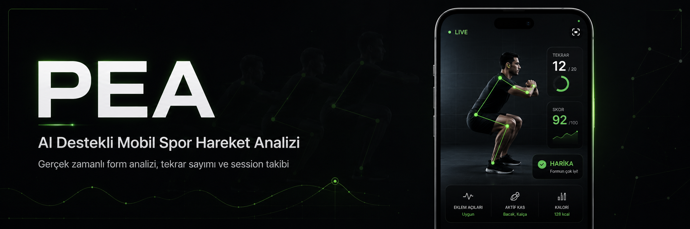

<div align="center">

# PEA

### Kamera tabanlı gerçek zamanlı egzersiz analizi uygulaması

Mobil cihaz kamerası üzerinden seçili egzersizlerde canlı analiz, oturum özeti ve egzersiz rehberi sunan Flutter tabanlı bir hareket analizi uygulaması.

<br/>

<p align="center">
  
</p>

<br/>


<br/>
<br/>


<br/>


</div>

---

## Proje Özeti

PEA, Google ML Kit pose landmarks kullanarak seçili egzersizlerde canlı analiz yapan bir Flutter uygulamasıdır. Kaynak kod bugün üç aktif analiz hareketi sunar: squat, plank ve push-up. Lunge ile sit-up uygulamada rehber içeriği olarak bulunur, ancak canlı analiz katalogunda aktif değildir.

## Aktif Analiz Desteği

| Egzersiz | Engine ailesi | Analiz | Temel çıktı |
| -------- | ------------- | ------ | ----------- |
| Squat | Range-rep | Aktif | Tekrar, skor, form sinyalleri |
| Plank | Hold | Aktif | Anlık süre, en iyi süre, form-break |
| Push-up | Range-rep | Aktif | Tekrar, skor, form sinyalleri |
| Lunge | Belirlenmedi | Kapalı | Rehber içeriği |
| Sit-up | Belirlenmedi | Kapalı | Rehber içeriği |

## Engine Aileleri

- `rangeRep`: `neutral -> descending -> peak -> ascending -> neutral`
- `hold`: `ready -> holding -> broken`
- `alternatingRep` enum olarak tanımlıdır, ancak `AnalysisEngineFactory` içinde henüz uygulanmamıştır.

Bugünkü katalogda squat ve push-up `rangeRep`, plank ise `hold` ailesini kullanır. README içindeki "analiz aktif" ifadesi, yalnızca katalog ve canlı analiz akışının bu hareketi açabildiği anlamına gelir.

## Destek Seviyeleri ve Doğrulama

| Katman | Ne anlama gelir | Ne anlama gelmez |
| ------ | ---------------- | ---------------- |
| Rehber içeriği | Hareket kartı, açıklama ve video yönlendirmesi vardır | Canlı analiz otomatik olarak aktiftir |
| Catalog desteği | `ExerciseCatalog` hareketi analiz için destekli işaretler | Hareketin her cihazda biyomekanik olarak kabul edildiği |
| Otomatik doğrulama | `flutter analyze`, `flutter test` ve PR CI kod yolunu doğrular | Gerçek cihaz kabulü veya saha doğrulaması |
| Cihaz doğrulaması | Profile build ve ayrı cihaz denemeleriyle ölçüm yapılır | Otomatik testlerin yerine geçen tek doğrulama katmanı |

Repository ayrıca `main` branch üzerinde elle tetiklenen `Android Profile Beta Artifact` workflow'una sahiptir. Bu yol profile APK ve commit SHA metadata'sı üretir; PR CI ile aynı şey değildir ve tek başına gerçek cihaz kabulü yerine geçmez.

## Uygulama Deneyimi

### Home

Kullanıcıyı zaman bazlı greeting card ve hızlı aksiyon grid’i ile karşılar. Gerçek oturum verisi varsa özet görünümü sunar; veri yoksa sahte metriklerle yanıltmak yerine sade bir başlangıç yüzeyi gösterir.

### Live Analysis

Kamera akışı üzerinden pose detection çalışır. Squat ve push-up için `rangeRep` faz takibi ile tekrar sayısı, skor ve form sinyalleri; plank için `hold` akışı ile anlık süre, en iyi süre ve form-break telemetrisi üretilir.

### Workout Summary & History

Tamamlanan oturum özetlenir, kaydedilir ve geçmiş ekranında yeniden incelenebilir.

### Guide

Hareketler için kısa amaç açıklamaları, kurulum adımları, teknik ipuçları, yaygın hatalar ve güvenilir dış video bağlantıları sunar.

### How to Use

Uygulamanın ne yaptığını ve nasıl kullanılması gerektiğini kısa, sade ve ürün içi onboarding tonunda açıklar.

---

## Teknik Yığın

### Mobil

* Flutter
* Dart

### Durum Yönetimi

* Riverpod

### Bilgisayarlı Görü

* Google ML Kit Pose Detection

### Backend / Veri

* Firebase Core
* Firebase Auth
* Cloud Firestore

### Yardımcı Paketler

* Shared Preferences
* fl_chart
* url_launcher

## Mimari Yaklaşım

Proje, feature odaklı ve katmanlı bir yapıyla ilerler.

```text
lib/
|-- app/
|-- core/
`-- features/
    |-- auth/
    |-- workout_analysis/
    |-- goals/
    |-- achievements/
    `-- chat/
```

### Temel prensipler

* analiz mantığını UI katmanından ayırmak
* Firebase erişimini repository katmanında toplamak
* feature bazlı yapıyı korumak
* kullanıcıyı sahte veriyle etkilemeye çalışmamak
* ürün yüzeylerini adım adım olgunlaştırmak

---

## Analiz Akışı

```text
Camera stream
  -> InputImage dönüşümü
  -> ML Kit Pose Detection
  -> Landmark çıkarımı
  -> Açı / hold sinyali hesaplama
  -> Range-rep faz takibi veya hold durumu
  -> Skor / feedback / hold telemetrisi
  -> Session özeti kaydı (Firestore)
```

Bu akış, canlı analiz ekranının temel omurgasını oluşturur.

## Rehber Yaklaşımı

Guide ekranı, uzun ve sıkıcı açıklamalardan oluşan bir broşür sayfası olarak değil, uygulama içi hızlı referans yüzeyi olarak tasarlanmıştır.

Her hareket için:

* kısa açıklama
* zorluk seviyesi
* amaç
* kurulum adımları
* teknik ipuçları
* yaygın hatalar
* güvenilir video yönlendirmesi

sunulur.

İlk sürümde video oynatımı uygulama içine gömülmemiştir. Bunun yerine kullanıcı, küratörlü YouTube bağlantısına yönlendirilir. Bu tercih, deneyimi hafif ve bakım maliyetini daha düşük tutar.

---

## Veri Saklama Modeli

Session verileri kullanıcı bazlı saklanır:

```text
users/{uid}/sessions/{sessionId}
```

Kaydedilen temel alanlar şunları içerir:

* egzersiz tipi
* `analysisKind`
* başlangıç zamanı
* bitiş zamanı
* süre
* toplam tekrar, ortalama skor, en iyi skor ve form uyarısı sayısı
* hold oturumları için toplam geçerli hold süresi
* hold oturumları için en iyi hold süresi
* hold oturumları için form-break sayısı

Mevcut Firestore session sözleşmesi özet seviyesindedir. Rep-level detaylar domain modelinde taşınabilse de bugünkü session dokümanı bu alanları persist etmez.

---

## Mevcut Sınırlamalar

Bu aşamada bilinçli olarak kabul edilen bazı sınırlar vardır:

* aktif analiz desteği bugün squat, plank ve push-up ile sınırlıdır
* plank, `hold` ailesinin ilk aktif örneğidir
* plank hold sinyal geometrisi bugün `plank.json` içindeki `holdSignals` ve `referenceSide` tanımından okunur
* `HoldContract`, hold motorunun beklediği semantik signal setini; `holdSignals` ise bu signal'ların referans landmark üçlülerini tanımlar
* hold pipeline aynı config'ten left ve right requirement setleri üretir; right-only plank pose'ları kabul edilip hold başlatabilir
* aktif hold attempt sırasında seçilen side lock edilir ve kısa visibility gap boyunca korunur
* hold engine kullanıcı mesajı yerine typed feedback code üretir; Türkçe kullanıcı mesajı presentation mapper'da kalır
* hold diagnostics artık typed phase, feedback ve last-visible posture state taşır; Beta Diagnostics JSON schema version `3` üzerinden bunları additive alanlarla gösterir
* missing body/arm/leg metric semantics'i bugün hâlâ mevcut production davranışını korur; bu debt yalnız görünür hâle getirilmiştir, düzeltilmemiştir
* `hold` ailesi henüz bütün statik egzersizler için kolayca genellenmiş, ikinci fixture ile kanıtlanmış bir şablon değildir
* kısa visibility gap sonrası hold devam edebilse de gizli süre hold toplamına eklenmez
* otomatik testler ve CI, gerçek cihaz kabulünün yerine geçmez
* session persistence bugün summary-level sözleşmeye dayanır

---

## Kurulum

### 1. Depoyu klonlayın

```bash
git clone https://github.com/bkrbzdgn40/pea.git
cd pea
```

### 2. Bağımlılıkları yükleyin

```bash
flutter pub get
```

### 3. Firebase yapılandırmasını hazırlayın

Projeyi çalıştırmadan önce Firebase tarafında gerekli yapılandırmayı tamamlayın:

* Firebase projesi oluşturun
* Android / iOS uygulamalarını ekleyin
* `flutterfire configure` çalıştırın
* `firebase_options.dart` dosyasını üretin

### 4. Uygulamayı başlatın

```bash
flutter run
```

## Yol Haritası

| Öncelik | Başlık | Not |
| ------- | ------ | --- |
| Yüksek | Yeni egzersiz enablement | Yeni hareketler ancak engine, test ve cihaz kanıtı ile aktif edilmeli |
| Yüksek | İkinci hold-family fixture | Hold ailesini plank dışına güvenli biçimde genişletmek için |
| Orta | Daha güçlü skor açıklaması | Neden bu skor üretildiğini daha anlaşılır göstermek için |
| Orta | Sesli geri bildirim | Anlık yönlendirme yüzeyini genişletmek için |
| Orta | Gerçek cihaz kabul kanıtlarını genişletme | Profile build ve saha ölçümlerini daha sistematik hale getirmek için |
| Orta | Test kapsamını artırma | Yeni enablement işlerini daha güvenli hale getirmek için |

---

## Katkı Notu

Bu repo aktif geliştirme altındadır. Katkı verirken özellikle şu prensiplere dikkat edilmesi önerilir:

* analiz çekirdeği ile UI düzenlemelerini karıştırmamak
* kullanıcıya gerçek olmayan veri göstermemek
* kısa ve açık ürün dili kullanmak
* bir hareketi kanıt tamamlanmadan `supported` yapmamak
* küçük ekran düzenlerini bozmamak
* feature bazlı yapının bütünlüğünü korumak

---

## Lisans

Bu repo için lisans bilgisi henüz eklenmemiştir. Lisans tercihi netleştiğinde bu bölüm güncellenecektir.

---

<div align="center">

**PEA, bugün doğrulanan analiz yüzeylerini koruyarak kapsamını adım adım genişletiyor.**

</div>
